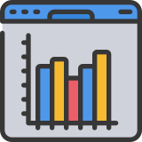

# Productivity Tracker Chrome Extension

A Chrome extension built with React to track and enhance personal productivity by monitoring browsing habits, setting goals, and managing focus sessions.





## Features

### Website Time Tracking
- Monitors time spent on different websites in real-time
- Automatically tracks active tabs and handles tab/URL changes
- Provides visual analytics of your browsing patterns

### Focus Timer with Pomodoro Technique
- 25-minute Pomodoro work sessions
- 5-minute short breaks and 15-minute long breaks
- Session tracking with sound and browser notifications
- Visual progress indicators

### Goal Setting
- Set daily productivity goals to stay motivated
- Limit time spent on specific distracting websites
- Track progress toward your time limits with visual indicators

### Analytics Dashboard
- Calculate productivity score based on browsing habits
- View detailed statistics about your website usage
- Track focus sessions completed and productivity trends
- Visualize website usage distribution

## Technologies Used

- React 19
- Vite
- Chrome Extension API
- Tailwind CSS
- JavaScript (ES6+)

## Installation

### Development Mode
1. Clone this repository
2. Install dependencies:
   ```
   npm install
   ```
3. Run the development server:
   ```
   npm run dev
   ```

### Load as Chrome Extension
1. Build the extension:
   ```
   npm run build
   ```
2. Copy necessary files to the dist folder:
   ```
   cp public/manifest.json dist/
   cp public/background.js dist/
   cp public/icon.png dist/
   ```
3. Open Chrome and navigate to `chrome://extensions/`
4. Enable "Developer mode" in the top-right corner
5. Click "Load unpacked" and select the `dist` folder

## Usage

### Dashboard Tab
The main interface provides:
- Website time tracking data
- Pomodoro timer for focused work sessions
- Settings to configure your productivity goals

### Analytics Tab
Detailed analytics include:
- Productivity score
- Visual representation of time spent on websites
- Progress tracking towards goals
- Focus session statistics

### Timer
1. Click "Show" to expand the timer
2. Select session type (Pomodoro, Short Break, Long Break)
3. Click "Start" to begin the timer
4. The timer will notify you when the session is complete

### Settings
1. Click "Show" to expand settings
2. Set your daily productivity goal
3. Specify websites you want to limit time on
4. Set daily time limits in minutes
5. Click "Save Settings" to store your preferences

## Privacy
All data is stored locally in your browser using Chrome's storage API. No data is sent to external servers.

## Project Structure

```
├── public/
│   ├── background.js       # Chrome extension background script
│   ├── manifest.json       # Extension manifest
│   └── icon.png            # Extension icon
├── src/
│   ├── components/         # React components
│   │   ├── Dashboard.jsx   # Website time tracking display
│   │   ├── Settings.jsx    # User preferences and goals
│   │   └── Timer.jsx       # Pomodoro timer
│   ├── pages/
│   │   ├── Home.jsx        # Main popup interface
│   │   └── Analytics.jsx   # Detailed statistics view
│   ├── utils/
│   │   └── storage.js      # Chrome storage utilities
│   ├── App.jsx             # Main application with navigation
│   ├── main.jsx            # Application entry point
│   └── index.css           # Global styles and Tailwind
└── package.json            # Dependencies and scripts
```

## Future Enhancements

- Website categorization (productive vs. distracting)
- Automatic website blocking during focus sessions
- Weekly and monthly reports
- Data export/import for backup
- Task management integration
- Custom timer durations

## License

MIT
